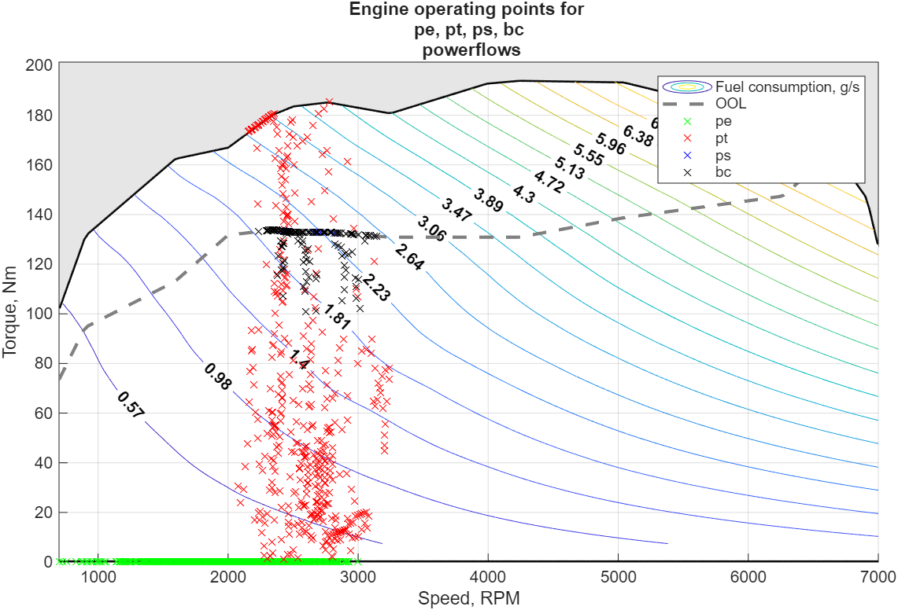
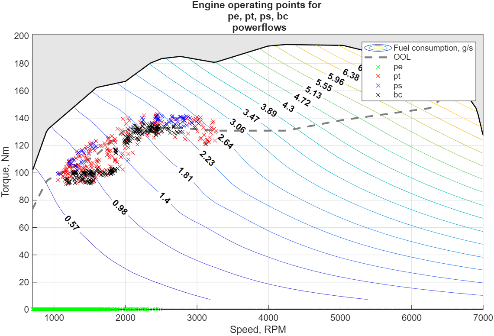
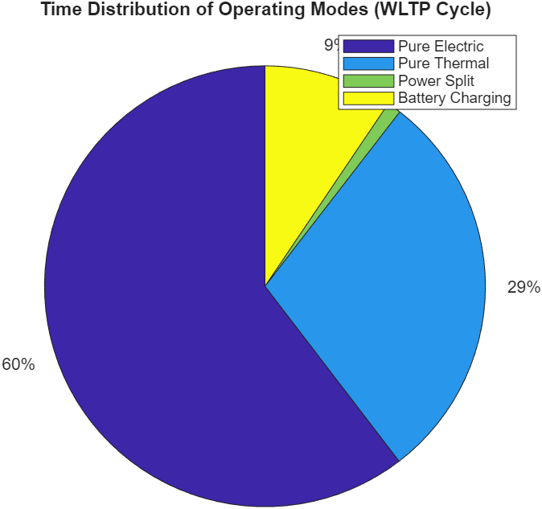
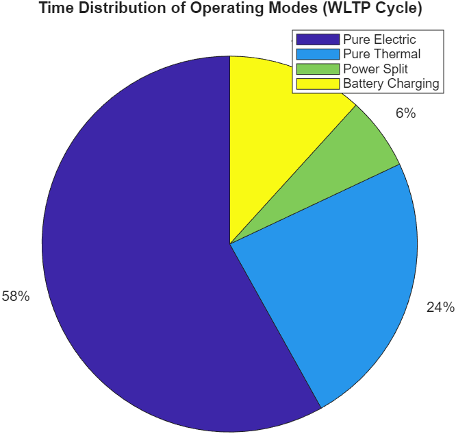
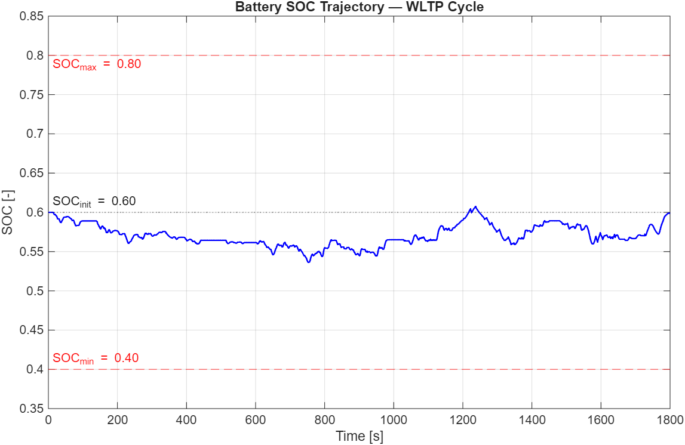
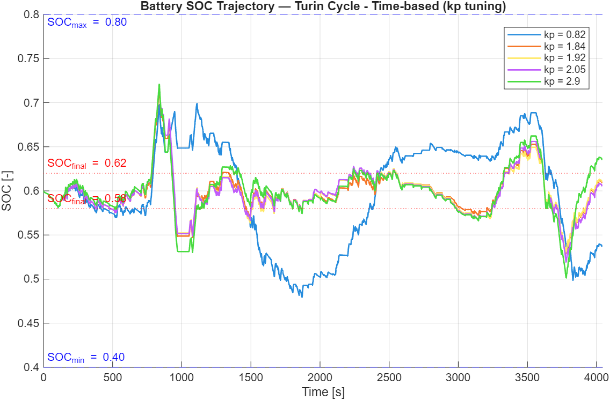
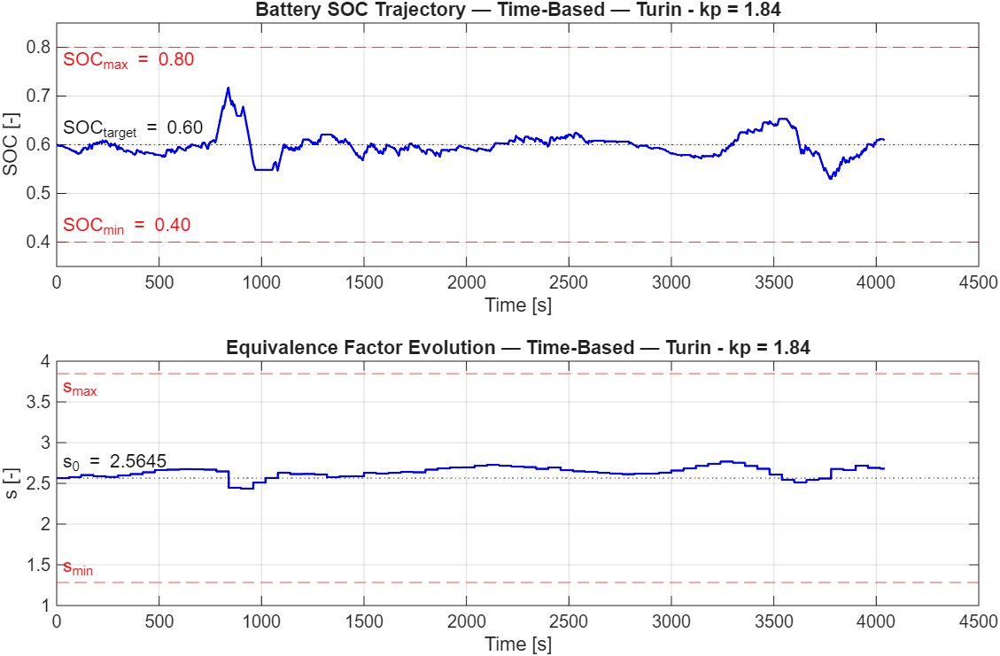
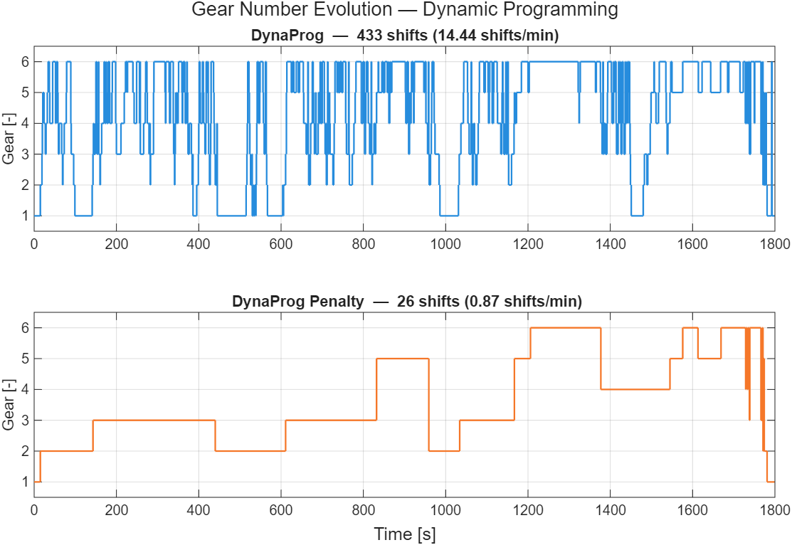
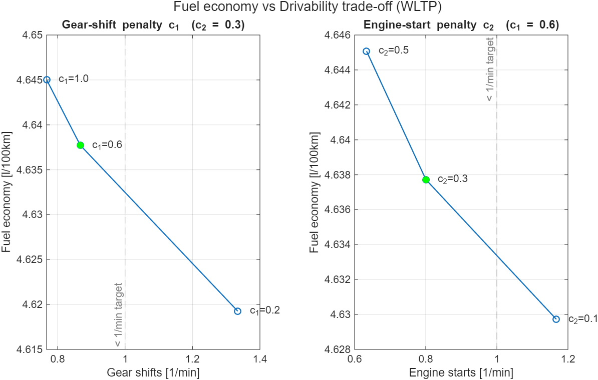

# Energy Management of a Parallel Hybrid Electric Vehicle

MATLAB implementation and comparison of four energy-management strategies for a **parallel (P2) hybrid
electric vehicle**, developed for the course **Energy Management for Hybrid Electric Vehicles**
(MSc in Automotive Engineering, Politecnico di Torino, A.Y. 2025/26).

The four strategies go from a heuristic controller to the global optimum:
**Rule-Based Control → ECMS → Adaptive ECMS → Dynamic Programming**.

<p align="center">
  
  
</p>
<p align="center"><em>Engine operating points on the WLTP cycle: rule-based control (left) vs ECMS (right).
ECMS keeps the loaded engine close to the optimal operating line (dashed).</em></p>

---

## Vehicle and simulation setup

- **Powertrain**: parallel P2 HEV, 118 kW engine, 27 kW e-machine, 2.1 kWh battery, 6-speed gearbox.
- **Model**: quasi-static backward-facing model with 1 s time step. Control variables are the gear number
  and the torque-split factor α<sub>eng</sub>: 0 = pure electric, 1 = pure thermal, 0–1 = power split,
  > 1 = battery charging by the engine.
- **Requirement**: charge-sustaining operation (initial SOC 0.60; final SOC within ±1 %, or a target band).
- **Cycles**: WLTP (labs 1, 2, 4); Turin Test and the Artemis Urban / Rural / Motorway cycles (lab 3).

## Results at a glance (WLTP)

| Strategy | Fuel economy [l/100 km] | Final SOC [-] | Notes |
|---|---|---|---|
| Rule-based, base | 5.18 | 0.590 | Heuristic thresholds on speed and SOC |
| Rule-based, enforce-SOC | 5.04 | 0.578 | Extra SOC window logic, −2.7 % fuel |
| **ECMS** | **4.50** | 0.599 | Equivalence factor s = 2.5645 (bisection) |
| **Dynamic Programming** | 4.56 | 0.609 | Global optimum on the discretised grid, but 14.4 shifts/min |
| DP + drivability penalties | 4.64 | 0.614 | 0.87 shifts/min, 0.80 engine starts/min |

> ECMS and DP end the cycle at different SOC (DP stores about 1 % more energy in the battery), so their
> fuel figures are not SOC-corrected and should not be read as "ECMS beats DP". Both are within
> 1.5 % of each other and about 10 % better than the best rule-based controller.

---

## 01 — Rule-based control

📁 [`01-rule-based-control`](01-rule-based-control) · 📄 [report (base)](Reports/Project_01_base.pdf) ·
[report (extra feature)](Reports/Project_01_extrafeature.pdf)

A torque-split controller based on rules, with pure electric drive below a tuned speed threshold
(v<sub>pe</sub> ≈ 50 km/h) and engine load-shifting depending on the SOC with respect to a target of 0.55.
An **extra "enforce-SOC" controller** adds a SOC window (0.52–0.65) that forces battery charging or
maximum electric assistance near its edges.

- Fuel economy drops from **5.18 to 5.04 l/100 km (−2.7 %)**. Pure-thermal time goes from 29 % to 24 %
  and power-split time increases.
- Limitation: pure-thermal operation still falls in low-efficiency regions of the engine map (the
  red points far below the optimal line).

<p align="center">
  
  
</p>

## 02 — Equivalent Consumption Minimisation Strategy (ECMS)

📁 [`02-ecms`](02-ecms) · 📄 [report](Reports/Project_02.pdf)

At every time step the controller picks the gear and torque split that minimise the
**equivalent fuel consumption**, i.e. engine fuel plus battery power weighted by an equivalence
factor *s*. The factor is calibrated with a **bisection algorithm** on the final SOC deviation and
converges in 9 steps to **s = 2.5645**.

- **4.50 l/100 km** with final SOC 0.599 (deviation 0.1 %).
- The engine runs only near its optimal operating line (thermal efficiency > 36 %). Pure electric covers
  69 % of the cycle.

<p align="center">
  
</p>

## 03 — Adaptive ECMS

📁 [`03-adaptive-ecms`](03-adaptive-ecms) · 📄 [report](Reports/Project_03.pdf)

The equivalence factor is updated online by a proportional law on the SOC error, so that the
controller does not depend on a factor calibrated offline for one cycle. Two variants are compared:

- **Time-based**: *s* is updated every 60 s. k<sub>p</sub> is tuned on the Turin Test with a two-stage rule:
  among the gains that respect final SOC ∈ [0.58, 0.62], SOC ∈ [0.40, 0.80] and |Δs| < 50 %, pick the one
  with the smoothest *s*. The result is **k<sub>p</sub> = 1.84**.
- **Distance-based**: *s* is updated every 1 km, with **k<sub>p</sub> = 1.5**.

| Cycle | Time-based [l/100 km] | Final SOC | Distance-based [l/100 km] | Final SOC |
|---|---|---|---|---|
| Turin Test (tuning) | 4.44 | 0.609 | 4.44 | 0.609 |
| Artemis Urban (×5) | 4.04 | 0.595 | 4.04 | 0.594 |
| Artemis Rural (×2) | 4.05 | 0.574 | 4.05 | 0.575 |
| Artemis Motorway | 6.88 | **0.633** | 6.99 | **0.683** |

Both variants generalise well to urban and rural driving. They miss the charge-sustaining band on the
motorway cycle, where the power demand is very different from the tuning cycle. The report discusses
possible improvements, such as tuning on the peak SOC deviation or using driving-pattern recognition.

<p align="center">
  
  
</p>

## 04 — Dynamic Programming

📁 [`04-dynamic-programming`](04-dynamic-programming) · 📄 [report](Reports/Project_04.pdf)

The fuel-optimal control sequence over the whole WLTP is computed with
[DynaProg](https://github.com/fmiretti/DynaProg). States: SOC (81 nodes). Controls: gear and α<sub>eng</sub>
∈ [0, 2.5] with step 0.05.

- **Baseline**: 4.56 l/100 km, but the solution is not drivable: **433 gear shifts (14.4/min)** and
  63 engine starts.
- **Drivability**: previous gear and previous engine state are added as states (81 × 6 × 2 = 972
  nodes), and every shift and engine start is penalised in the stage cost
  ([`hev_cell_model_penalty.m`](04-dynamic-programming/hev_cell_model_penalty.m)). With
  c<sub>1</sub> = 0.6 and c<sub>2</sub> = 0.3 the result is **26 shifts (−94 %) and 24 engine starts (−62 %)**,
  for only **+1.6 % fuel**.
- A sweep of c<sub>1</sub> and c<sub>2</sub> makes the fuel–drivability trade-off explicit.

<p align="center">
  
  
</p>

---

## Repository structure

```
├── Common/                    shared vehicle data, powertrain models and plotting utilities
│   ├── data/                  vehData.mat, WLTP.mat, scaleVehData.m, ...
│   ├── models/                hev_model.m, hev_cell_model.m (vectorised, for DynaProg), ...
│   └── utilities/             engine / e-machine map plots, power profiles, ...
├── 01-rule-based-control/     Project_01.mlx (+ .m export), results
├── 02-ecms/                   Project_02.mlx (+ .m export), results
├── 03-adaptive-ecms/          Project_03.mlx (+ .m export), Turin / Artemis cycles
├── 04-dynamic-programming/    Project_04.mlx (+ .m export), hev_cell_model_penalty.m, results
└── Reports/                   PDF export of each live script, with full discussion
```

## How to run

1. Set the lab folder as the MATLAB current folder (e.g. `02-ecms`).
2. Run the live script (`.mlx`). Each script adds `Common/` to the path by itself.
3. `Project_01` asks which controller to run (1 = base, 2 = enforce-SOC).

Indicative run times: labs 1–2 under 15 s, lab 3 about 40 s, lab 4 about 4 min (it solves 8 DP problems).

**Requirements:** MATLAB **R2025b** (the version used for development), Optimization Toolbox (used by one
course utility), and [DynaProg](https://github.com/fmiretti/DynaProg) for lab 4. DynaProg can be
installed from the MATLAB Add-On Explorer.

## Authors

Group 46: **Dennis Bettinsoli**, **Matteo Canestrini**, **Simone Massucco**.

The vehicle data, powertrain models and utilities in `Common/` and the driving cycles were provided by the
course instructors of *Energy Management for Hybrid Electric Vehicles*, Politecnico di Torino.
DynaProg is developed by Federico Miretti.
